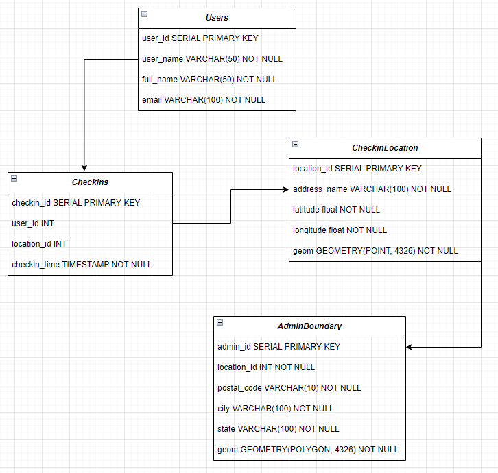

# bounceChallenge

# Runbook:
## Part 1:

1. Grab token from Github by following the instruction here
2. Ensure you have the following libraries installed and ready to be imported

```
import pandas as pd
import requests
```
3. Write your first scraper by adding yourr github_token the class  `scraper = GitHubScraper(user_account='bounceapp', github_token='xxxx_token')`
4. Now you have the scraper class, you can decided to read the extracted data to dataframe before exporting by `df = scraper.scrape_github_data()`
5. Now you are read to export the data `scraper.scrape_and_export('data/github_data.csv')`

## Part 2

Write a SQL query that returns the top 3 products in each category with the highest total sales in the last week, but only for the customers that registered in the past year. Also, filter out the results for the categories that have total sales of less than 100 units in the past week. Please use window functions to accomplish this.

#### Solution

The solution script is found here - `scripts/Top Selling Product.sql`

What is happening within the script:
- The script calculates the weekly sales for each product in each category
- Then filters the sales data to include only categories with the total sales of less than 100 units in the past week
- I used the ROW_NUMBER() function to rank the product within each category based on their total sales.
- I went further to filters the results to include only customers from the recent_customers table.
- Finally, I order the results by category and total sales in descending order.

In all, this query identify the top selling products in each category over the past week, but only for the customers who registered within the past year. It also ensures that only categories with total sales less than 100 units.

## Part 3

### Geospatial Modeling Challenge
##### Assumptions:
1. Users provide address information including latitude and longitude. 
2. This system is a Postgres database



 - Users Table: Each user has a unique user_id. The user_name, full_name, and email columns are required and must not be NULL.

- CheckinLocation Table: Each location has a unique location_id. The admin_id column is a foreign key referencing the admin_id column in the AdminBoundary table. The address_name column represents the name of the location and must not be NULL. The geom column stores the geometry of the location as a POINT.

- Checkins Table: Each check-in has a unique checkin_id. The user_id column is a foreign key referencing the user_id column in the Users table. The location_id column is a foreign key referencing the location_id column in the CheckinLocation table. The checkin_time column stores the timestamp of the check-in and must not be NULL.

- AdminBoundary Table: Each administrative boundary has a unique admin_id. The postal_code, city, and state columns represent the postal code, city, and state information for the administrative boundary, respectively. The geom column stores the geometry of the boundary as a POLYGON.

## Part 4

You will find the solution to this question as a document in the folder `reports`.